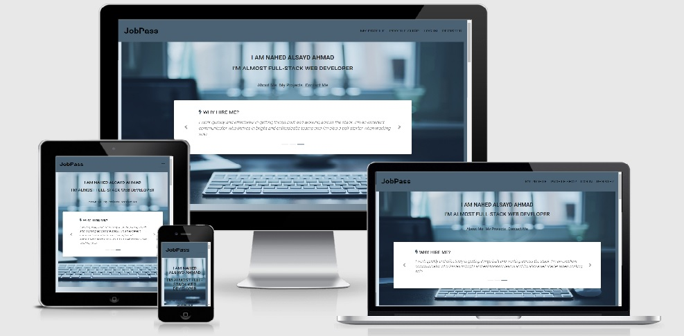

<h1 >JobPass</h1>

*Welcome to my project!* [View the live project here(JobPass)](https://https://flask-jobpass-project.herokuapp.com/.)

## Introduction

Jobpass was created by Nahed Alsayed Ahmad, as a portfolio to include all created projects as well as to serve all users to create their own portfolios.
I know how important it’s to have a place where you can create your own portfolio by adding your Personal information, Work Experience, skills, and Projects to help everyone have better job opportunities.
The website is fully responsive, has a consistent flow and intuitive navigation.

## Table of Contents
1. [UX](#ux)
    - [Goals](#goals)  
    - [User Stories](#user-stories)
    - [Design ](#design)
    - [Wireframes](#wireframes)

2. [Features](#features)
    - [Existing Features](#existing-features)
        - [In all pages](#in-all-pages)
        - [My profile Page](#profile-page)
        - [Portfolios Page](#Portfolios-page)
        - [New Profile Page](#add-profile-page)
        - [Manage Profile Page](#create-account-page)
        - [Register Page](#register-page)
        - [Log In Page](#log-in-page)
        - [Log Out](#log-out)
           
    - [Features Left to Implement](#features-left-to-implement)

3. [Information Architecture](#information-architecture)
    - [Database choice](#database-choice)
    - [Data Storage Types](#data-storage-types)
    - [Collections Data Structure](#collections-data-structure)
        - [Users Collection](#users-collection)
        - [ Collection](#collection)

4. [Technologies Used](#technologies-used)
5. [Testing](#testing)
6. [Deployment](#deployment)
    - [Heroku Deployment](#heroku-deployment)
    - [How to run this project in gitpod](#how-to-run-gitpod)

7. [Credits](#credits)
    - [Content](#content)
    - [Media](#media)
    - [Acknowledgements](#acknowledgements)
8. [Disclaimer](#disclaimer)
9. [Thank you](#thank-you)

****************************************************

# UX
## Goals

The central target audience for JobPass are:
- Job seekers who want to create their own portfolios or resumes
- Recruiters who are looking for the right candidates (Freelance or Full Time Staff)
- Freelance developers who are looking for a temporarily support on their projects
- Companies or individuals who are looking for developers to create their own websites

Visitor Goals:
- As a user:
    Find an easy way to create a new profile with the ability to update it to help me finding the most suitable job

- As a recruiter:
    Find the right candidates where their experience matching any available vacancy

- As a freelance developer:
    Find a junior developer who currently looking for a freelance opportunity

- As Site Owner Goals:
    I want to get interviews offers by using the Contact Form.
    I want to be able to attract the attention to my completed projects.
    I want to sell show my capabilities in professional way.

## User Stories:

- As a user to JobPass I expect/want/need :
    - To easily find what I am looking for without being confused with what I need to click or where should I go
    - To register and create my own credentials with a click of a button
    - To easily manage my profile and update my existing Personal information, Work Experience, Projects, Skills, and Languages.
    - To be able to log in to access my existing entries, and for my data to only be editable with my account.
    - To be able to contact the developer/site owner whenever a support is needed
    - To have an easy access to Contact Information, Phone Numbers, email addresses, and Social Media links
    - To be able to access Jobpass from a mobile phone or tablet and to be easy to navigate and use on my smaller devices.

- As a recruiter, I expect/want/need:
    - To easily search for job seekers with the ability to contact them directly
    - To be able to contact the developer/site owner whenever a support is needed
    - An easy access to the contact information, phone number and email for the people I am looking for.

-  As a freelance developer, I expect/want/need:
    - To find the developer’s last projects with the ability to check them with a click of a button
    - To easily get in touch with site developer or owner via contact form

 ## Design

 #### Colour Scheme
          The main colors used are: #4a6274 , #f3a7a7
          The body background : linear-gradient(to left, #4a6274, #d9e5ee)
            
#### Typography
        -   The "Roboto" font is the main fonts used throughout the whole website with "font-italic" class for some paragraph .
        - Sans Serif as the fallback font in case for any reason the font is not being imported into the site correctly.
    

## Wireframes

1. All Wireframes are created by using [Balsamiq](https://balsamiq.com/).
2. Tablet and Desktop wireframes have the same view. 
3. [Wireframes](https://github.com/nahed2019/jobpass-ms3/tree/master/static/wireframes)
4. As the wireframes were designed at the beginning of the project, the layout of some of the pages has been changed without impact the content of those pages.
5. The name of profile shop page changed to Portfolios page.

# Features
 
## Existing Features

###  In all pages
- Navbar:

        For visitors to the site who are not logged in/Registered
        list items links are available for them to use:
        1. My profile
        2. Portfolios 
        3. Log in 
        4. Register
       
      For users who are logged in/Registered: 
        1. My profile
        2. Portfolios
        3. New Profile
        4. Manage Profile
        5. Log out

    - Python determines if the user is logged in or not by checking `if 'user' in session` and passes this data to Jinja to display the correct navbar for the user.

    - The navbar is collapsed into a burger icon on small and medium screens.
    
-  Floating to top button:
    - A floating button appears on the lower right of the screen when the user starts to scroll downwards. Clicking this moves the view back up to the top of the page. I added this feature because some pages can be quite long and the navbar is not fixed to the top of the page.

- Footer
    - The footer features:
        - About this Project.
        - Download link to my CV. 
        - A list of useful links users might need when viewing the footer. 
        - Copyright information.
        - Links to social media locations (Which will eventually be linked up to the jobpass  social media platforms, once they exist).

### My profile Page

- Upon clicking on My profile, details of the Site Developer will appear along with three mini tabs, About Me, My Projects, and Contact Me
- You will find a summary box contains What Do I Do, How Do I Do It, and Why Hire Me? it  appears on desktop and tap view only.
- About Me includes a summary of experience, hobbies, and a note of what I aim to achieve
- It also includes my Skills along with the level of each skill
- A list of my Milestone projects that I did while studying in Code Institute
- You will be able to see a contact form with some details to be filled if you wish to get in touch with me. Upon filling the form and click on send, email will be sent to me with your details

### Portfolios Page
- Business cards for all users who successfully registered and created their own profiles. Business card will include below details:
    Current work
    Phone Number
    Email Address
    Education
    Address
- A search bar where you can search with Current Work, Education, or Address to find the business cards of any job seeker
- In the Search bar, you will find a Reset button to reset the search results

### New Profile Page
- Upon successful registered with your username and password, it will direct you to the New Profile page where you can find 5 Tabs to add your information:
1. Add your basic information
2. Add your projects information
3. Add your work experience
4. Add your skills information
5. Add your languages information
- A button is there to save the information you are adding
- Upon saving, you will get a flash massage that Information is Successfully updated

### Manage Profile Page
- Upon successful login with your username and password, it will direct you to the Logged In page where you can find your Profile data if you add it in New profile page correctly and you will fimd your portfolio:
    1. Your Name
    2. Current Work
    3. Three mini tabs, About, Projects & Work Experience, and Skills
    4. About Me includes Cards with Personal Information, Languages, Address, Phone Number, and Email Address
    5. Projects & Work Experience includes all your projects and work experience
    6. Skills List includes all your added skills with the level of each skill
- An option to edit or delete any of Projects & Work Experience and Skills is there as an Icon, it opens new page for edit information with information retrieved from MongoDB, based on the -ID. These fields can be altered to update an existing information.

### log In Page
- The log in page also features a simple **form** where the user can enter username, password and a login button.
- When the user fails to enter the correct username and/or password a flash message is shown above the login form.

### Register Page
The Register page also features a simple **form** where the user can enter username, password and a Register button to create new user and send the data to the Mongo Db.
- When the user chooses an existing name in MongoDB a flash message is shown above the Register form.

## Features Left to Implement

1. Link the business cards on the Portfolios page to each user's profile page or to his CV.
2. Create a form for each business card on the Portfolios page in which the recruiters can communicate directly with the job seeker of certain profile.

# Information Architecture
### Database Choice
    This project utilizes two types of Data:
        1. The NoSQL database MongoDB.
        2. Local JSON Files      

### Data Storage Types

#### The types of data stored in MongoDB for this project are:
- ObjectId
- String
- Integer

### Collections Data Structure

The JobPass website relies on 6 database collections:
[Example JSON from the MongoDB collections](data/schemas/example.json)

#### Users Collection

| Title | Key in db | Data type |
|------ | --- ------| --- ------|  
|Account ID | _id |  ObjectId| 
|Name | username  | string |
|Password | password  | string |

#### basic_info Collection
| Title | Key in db | Data type |
|--- | --- | --- |
|Account ID | _id | ObjectId |
|First Name | first_name  | string|
|Last Name | last_name  | string|
|Phone | phone  | string|
|Email | email  | string|
|Curent Job | cur_title  | string|
|Education | education  | string|
|Adress  | adress  | string|
|About me | about_me  | string|
|Created by | created_by  | string|

#### projects Collection

| Title | Key in db | Data type |
|--- | --- | --- |
|Account ID | _id | ObjectId |
|Project Name | project_name  | string|
|Project Description| project_desc  | string|
|Project link| project_link  | string|
|Created by | created_by  | string|

#### skills Collection

| Title | Key in db | Data type |
|--- | --- | --- |
|Account ID | _id |  ObjectId |
|Skill Name | skill_name  | string|
|Percent | percent  | Integer|
|Created by | created_by  | string|

#### work_experience Collection

| Title | Key in db | Data type |
|--- | --- | --- | 
|Account ID | _id |  ObjectId |
|Job Name | job_title  | string|
|Company Nam | company_name  | string|
|Start date | from_date  | string|
|End date | to_date  | string|
|Created by | created_by  | string|

#### Languages Collection

| Title | Key in db | Data type |
|--- | --- | --- | 
|Account ID | _id | ObjectId |
|Language Name | language_name  | string|
|Language Level | language_level  | string|
|Created by | created_by  | string|

#### The types of data stored in local json files for this project are:
[project JSON ](data/projects.json)
[skills JSON ](data/skills.json)

projects data:

{
        "project_name": " name of the projects",
        "project_description": "description of the project",
        "project_image": "image",
        "live_url": " iive link for the project",
        "github_url":"link to github repo of the projects"
    },

skills data:
{
        "skill_name": "skill name",
        "percent" : "percent of the skill",
        "icon": "icon of the skill ",
        "colour": "color's of the skill"
    },

## Note for the assessor

To test the CRUDs functionalities:

| **URL**                                              | **Username** | **Password** |
| ---------------------------------------------------- | ------------ | ------------ |
| [Jobpass](https://https://flask-jobpass-project.herokuapp.com/.) | wfattah     | nanaroro         |

## Technologies Used

### Libraries

- [JQuery](https://jquery.com) to simplify DOM manipulation.
- [Bootstrap](https://www.bootstrapcdn.com/) to simplify the structure of the website and make the website responsive easily.
- [FontAwesome](https://www.bootstrapcdn.com/fontawesome/) to provide icons for Family Hub.
- [Google Fonts](https://fonts.google.com/) to style the website fonts.
- [PyMongo](https://api.mongodb.com/python/current/) to make communication between Python and MongoDB possible.
- [Flask](https://flask.palletsprojects.com/en/1.0.x/) to construct and render pages.
- [Jinja](http://jinja.pocoo.org/docs/2.10/) to simplify displaying data from the backend of this project smoothly and effectively in html.
- Weasyprint : to convert the html page to pdf file

### Tools

- [EmailJS](https://www.emailjs.com/)
- [Git](https://github.com/) to handle version control.
- [Heroku](http://www.heroku.com) to deploy this project.
- [PIP](https://pip.pypa.io/en/stable/installing/) for installation of tools needed in this project.
- [gitpod](https://www.gitpod.io/): is the IDE used for developing this project.
- [MongoDB Atlas](https://www.mongodb.com/cloud/atlas) is the database for this project
- [GitHub](https://github.com/) to store and share all project code remotely.
- [Browserstack](https://www.browserstack.com/) to test functionality on all browsers and devices.
- [Am I Responsive](http://ami.responsivedesign.is/) to create the images in this readme file of each page displayed on different screen sizes.
- [Balsamiq](https://balsamiq.com/) to create the wireframes.

### Languages

- [HTML](https://developer.mozilla.org/en-US/docs/Web/Guide/HTML/HTML5)
- [CSS](https://developer.mozilla.org/en-US/docs/Web/CSS/CSS3)
- [JavaScript](https://developer.mozilla.org/en-US/docs/Web/JavaScript)
- [Python](https://www.python.org/)

## Testing
### Validation Services
- HTML was checked on [HTML Validator](https://jigsaw.w3.org/css-validator/#validate_by_input).
- CSS was checked on [W3C Markup Validator](https://validator.w3.org/) .
- My JavaScript code passes through a linter (jshint.com) with no major issues.[jshint.com](https://jshint.com/)
- JSON was checked on [JSON Validator](https://jsonlint.com/).
- [Browserstack](https://www.browserstack.com/) to test functionality on all browsers and devices.

### Manual Testing
- The responsiveness of this website was tested constantly during the development process. It was tested in real desktops, tablets and mobile devices as well as on Google Chrome developer tools.
- The website was tested on different browsers such as Google Chrome, Safari, Internet Explorer and Mozilla Firefox.
- I asked friends and family members to test the functionalities of the website on desktop and mobile devices. Their feedback was used to improve website usability.
- All links, buttons, forms, navbar and pages functionalities were tested regularly while working in the project.

### Testing User Stories from User Experience (UX) Section:
The following section goes through each of the user stories from the UX section of User Stories:
- As a user to JobPass I expect/want/need :
    - To easily find what I am looking for without being confused with what I need to click or where should I go:
    * Simple and clear Navbar added at the top of the screen.
    * The navbar shows the user appropriate links depending on if they are logged in or out.
    * FAQ's added to the link in the footer to help the user.
    - To register and create my own credentials with a click of a button:
    * The register page features a simple form where the user can enter username, password and a register button.
    - To easily manage my profile and update my existing Personal information, Work Experience, Projects, Skills, and Languages:
    *  An option to edit or delete any of Projects & Work Experience and Skills is there near each information , it opens new page for edit information with information retrieved from MongoDB, based on the -ID. These fields can be altered to update an existing information.
    - To be able to contact the developer/site owner whenever a support is needed:
    * In contact section/My profile After filling all necessary information,an email is successfully send and a toast message is shown above the form confirming the email was sent.
    - To have an easy access to Contact Information, Phone Numbers, email addresses, and Social Media links
    * In the contact form and the footer of the page, you will find all information in clear and simple way.
    - To be able to access Jobpass from a mobile phone or tablet and to be easy to navigate and use on my smaller devices.
    * JobPass was designed to be responsive and work well on mobile, tablet and desktop devices.

- As a recruiter, I expect/want/need:
    - To easily search for job seekers with the ability to contact them directly
    * In Portfolios page/ search bar where you can search with Current Work, Education, or Address to find the business cards of any job seeker
    - To be able to contact the developer/site owner whenever a support is needed
    * In the contact form and the footer of the page, you will find all information in a clear and simple way.
    - An easy access to the contact information, phone number and email for the people I am looking for.
    * Business cards for all users who successfully registered and created their own profiles. Business card will include below details:
        Current work
        Phone Number
        Email Address
        Education
        Address

-  As a freelance developer, I expect/want/need:
    - To find the developer’s last projects with the ability to check them with a click of a button
    * In My Profile/ Project section, the user will find the projects I have worked on recently. It contains an image of the project in a desktop screen along with a brief description of the project and two buttons for the project's GitHub repository and the project's live website.
    - To easily get in touch with site developer or owner via contact form
    * In the contact form and the footer of the page, you will find all information in a clear and simple way.

### Bugs

### Solved bugs

1. The option of downloading the profile as PDF in Manage Profile Page was wrongly directing to Log In page.
 Issue has fixed by creating a new function to get the needed data then call another function which convert the data to PDF. 
 Credit: I got help from my mentor to fix this issue.

2.  I got an error in my workspace terminal : "GET /favicon.ico HTTP/1.1" 404:
Issue has fixed by adding <link rel="shortcut icon" href="#" /> to the header section.
Credit: I got help from (https://stackoverflow.com/questions/39149846/why-am-i-seeing-a-404-not-found-error-failed-to-load-favicon-ico-when-not-usin)

### Unsolved bugs

- When we click on the downloading option/Manage profile page the PDF file is showing the layout of Manage Profile without showing any data. 
Issue Not Fixed Yet. I’m still working on a solution to fix the issue

# Deployment

## Heroku Deployment

To deploy JobPass to heroku, the following steps were taken:

1. Created a `requirements.txt` file using the terminal command `pip3 freeze -- local > requirements.txt`.

2. Created a `Procfile` with the terminal command `echo web: python app.py > Procfile`.

3. `git add` and `git commit` the new requirements and Procfile and then `git push` the project to GitHub.

3. Created a new app on the [Heroku website] by clicking the "New" button in my dashboard. Gave it a  name and set the region to Europe.

4. From the heroku dashboard of my applicaiton, clicked on "Deploy" > "Deployment method" and selected GitHub.

5. Confirmed the linking of  heroku app to the correct GitHub repository.

6. In the heroku dashboard for my application, clicked on "Settings" > "Reveal Config Vars".

7. Set the following config vars:

| Key | Value |
 --- | ---
DEBUG | FALSE
IP | 0.0.0.0
MONGO_URI | `mongodb+srv://<username>:<password>@<cluster_name>-qtxun.mongodb.net/<database_name>?retryWrites=true&w=majority`
PORT | 5000
SECRET_KEY | `<secret_key>`

8. In the heroku dashboard, clicked "Deploy".

9. In the "Manual Deployment" section of this page, made sure the master branch was selected and then clicked "Deploy Branch".

10. The site was successfully deployed.

### Forking the GitHub Repository

By forking the GitHub Repository we make a copy of the original repository on our GitHub account to view and/or make changes without affecting the original repository by using the following steps...

1. Log in to GitHub and locate the [GitHub Repository](https://github.com/)
2. At the top of the Repository (not top of page) just above the "Settings" Button on the menu, locate the "Fork" Button.
3. You should now have a copy of the original repository in your GitHub account.

### Making a Local Clone

1. Log in to GitHub and locate the [GitHub Repository](https://github.com/)
2. Under the repository name, click "Clone or download".
3. To clone the repository using HTTPS, under "Clone with HTTPS", copy the link.
4. Open Git Bash
5. Change the current working directory to the location where you want the cloned directory to be made.
6. Type `git clone`, and then paste the URL you copied in Step 3.
$ git clone https://github.com/YOUR-USERNAME/YOUR-REPOSITORY

## How to run this project locally
This project can be ran locally by following the following steps: (Steps may differ in GitPod/Windows/Linux.)
1. Visit this repository link and click on the Clone or Download button to copy the link provided.
2. In your IDE, open a Terminal window and change to the directory where you want to clone this repository
3. $ git clone https://the link provided from clone repository.
After pressing Enter the project will be created and cloned locally.
4. The following must be installed on your machine:
- [PIP] installed on your machine.
- [Python 3] installed on your machine.
- An account at [MongoDB Atlas](https://www.mongodb.com/cloud/atlas) or MongoDB 
running locally on your machine.
Create a file called "env.py" and store your SECRET_KEY variable, your MONGO_URI to link to your database, your cluster name in MONGODB_NAME. The cluster name for this project is portfolio_manager. You will find the JSON structure for this cluster collections in the schemas folder.
- Do not commit this file to Git. * To hide your environment variables, create a file called ".gitignore" and write "env.py" on this file.
- Install the necessary libraries by running $ pip3 install -r requirements.txt
- Run your application with the command $ python3 app.py

# Credits

## Content

- All Content was written by developer.

### Media

- Hero Images were downloaded from Google.com

### Acknowledgements
### Credit code: 

- Code for add-edit-and-delete-buttons taken from https://bootstrapious.com/p/bootstrap-add-edit-and-delete-buttons and edited to fit project needs
- code for carousel-container taken from https://bootstrapious.com/p/bootstrap-carousel-with-quotes and edited to fit project needs.
- code for Progress Circle taken from https://bootstrapious.com/p/circular-progress-bar and edited to fit project needs.
- code for vertical Tabs taken from https://bootstrapious.com/p/bootstrap-vertical-tabs
and edited to fit project needs.
- Code for floating buttons taken from this [W3Schools](https://www.w3schools.com/howto/howto_js_scroll_to_top.asp) and edited to fit project needs.

## Disclaimer
The content of this website is educational purposes only.

## Thank you

- Thanks to the Tutors for helping me in completing this level. All the classes and lessons were very valuable and had a great added value to my knowledge and future career.
- Thank you *Igor Basuga* and *Tim Nelson* from Code Institute Tutor for your assistance.
- I would like to express my gratitude to the great efforts done by my Mentor.
- Thanks for all Student Care Advisers which supported the Students.
- Thanks for my husband  who has always supported me.
